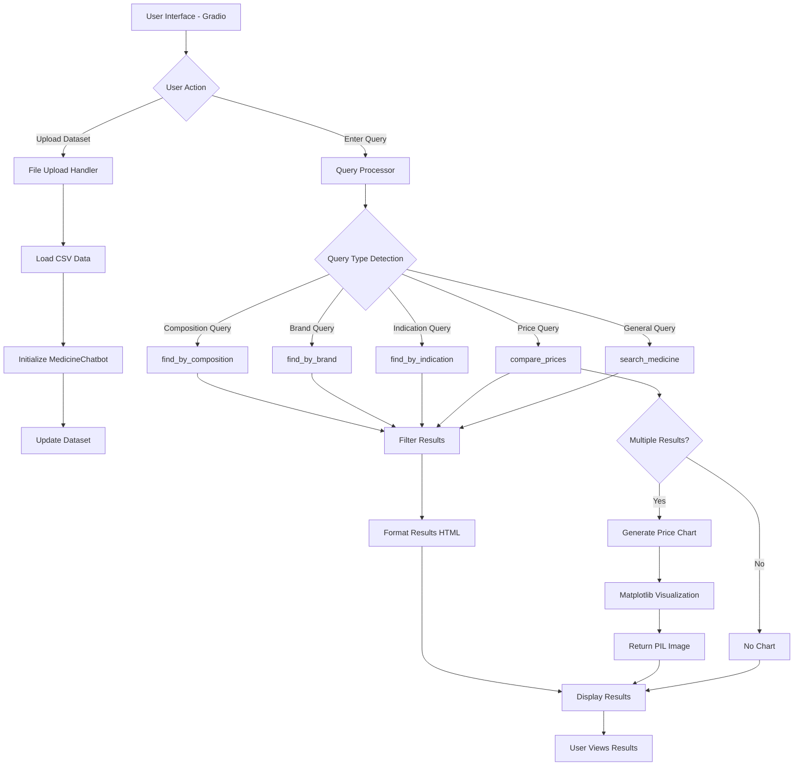

# 💊 Medicine Information Chatbot

A powerful, interactive web-based chatbot built with **Gradio** that helps users search for medicines, compare prices, find alternatives, and explore detailed medicine information. The application features a beautiful gradient UI with smart query processing and data visualization capabilities.


## 🌟 Features

### 🔍 Smart Search Capabilities
- **Free-text Search**: Search medicines by name, brand, composition, or indication
- **Composition-based Search**: Find all medicines containing specific ingredients
- **Brand Search**: Discover medicines from specific manufacturers
- **Indication Search**: Get medicines for specific health conditions
- **Price Comparison**: Compare prices across different brands of the same medicine

### 📊 Data Visualization
- **Interactive Price Charts**: Visual bar charts comparing medicine prices
- **Color-coded Results**: Easy-to-read gradient cards with high contrast
- **Cheapest Option Highlight**: Automatically identifies the most affordable option

### 📤 Dataset Management
- **Sample Dataset**: Pre-loaded with 10 common medicines
- **Custom Dataset Upload**: Upload your own CSV files with medicine data
- **Flexible Data Structure**: Supports various medicine information fields

### 🎨 Modern UI/UX
- **Gradient Design**: Beautiful purple and green gradient themes
- **Responsive Layout**: Works seamlessly on desktop and mobile
- **Icon Integration**: Visual icons for better user experience
- **High Contrast**: Optimized for readability

## 📋 System Architecture


## 🛠️ Technology Stack

- **Python 3.8+**: Core programming language
- **Gradio**: Web interface framework
- **Pandas**: Data manipulation and analysis
- **Matplotlib & Seaborn**: Data visualization
- **NumPy**: Numerical computations
- **Pillow (PIL)**: Image processing

## 📦 Installation

### Prerequisites
```bash
pip install gradio pandas numpy matplotlib seaborn pillow
```

### Clone the Repository
```bash
git clone https://github.com/yourusername/medicine-chatbot.git
cd medicine-chatbot
```

### Run the Application
```bash
python medicine_chatbot.py
```

The application will launch and provide:
- **Local URL**: `http://127.0.0.1:7860`
- **Public URL**: `https://xxxxx.gradio.live` (valid for 72 hours)

## 💻 Usage Guide

### 1. Starting the Application
Run the Python script, and the Gradio interface will open automatically in your browser.

### 2. Using Sample Dataset
By default, the chatbot loads with a sample dataset containing 10 medicines. You can start querying immediately.

### 3. Uploading Custom Dataset
- Click on **"Upload CSV File"**
- Select your medicine dataset (CSV format)
- Click **"Load Dataset"**
- Wait for confirmation message

### 4. Query Examples

#### Search by Medicine Name
```
paracetamol
ibuprofen
```

#### Search by Composition
```
What medicines contain paracetamol?
medicines with cetirizine
```

#### Search by Indication
```
medicines for fever
Show me medicines to treat diabetes
```

#### Search by Brand/Manufacturer
```
medicines from Cipla
What does GSK manufacture?
```

#### Compare Prices
```
Compare prices of Paracetamol
price of ibuprofen
```

## 📊 Dataset Format

Your CSV file should include the following columns:

| Column Name | Description | Example |
|-------------|-------------|---------|
| `medicine_id` | Unique identifier | 1, 2, 3... |
| `medicine_name` | Generic name | Paracetamol |
| `brand` | Brand name | Crocin |
| `manufacturer` | Company name | GSK |
| `composition` | Active ingredients | Paracetamol |
| `price` | Price in currency | 15.50 |
| `dosage_form` | Form of medicine | Tablet, Capsule |
| `strength` | Dosage strength | 500 mg |
| `indications` | What it treats | Fever and pain |
| `side_effects` | Possible side effects | Nausea, rash |
| `prescription_required` | Yes/No | No |

### Sample CSV Structure
```csv
medicine_id,medicine_name,brand,manufacturer,composition,price,dosage_form,strength,indications,side_effects,prescription_required
1,Paracetamol,Crocin,GSK,Paracetamol,15.50,Tablet,500 mg,Fever and pain,Nausea and rash,No
2,Ibuprofen,Brufen,Abbott,Ibuprofen,45.00,Tablet,400 mg,Pain and inflammation,Stomach upset,No
```

## 🔧 Core Functionalities

### MedicineChatbot Class

#### `__init__(data=None)`
Initializes the chatbot with optional custom dataset or creates sample dataset.

#### `create_sample_dataset()`
Creates a default dataset with 10 medicines for testing.

#### `search_medicine(query: str)`
Performs free-text search across medicine name, brand, composition, and indications.

#### `find_by_composition(composition: str)`
Filters medicines by specific composition/ingredient.

#### `find_by_brand(brand: str)`
Returns all medicines from a specific brand or manufacturer.

#### `find_by_indication(indication: str)`
Finds medicines that treat specific conditions.

#### `compare_prices(medicine_name: str)`
Compares prices of different brands for the same medicine.

#### `process_query(query: str)`
Intelligent query router that detects intent and calls appropriate search function.

#### `format_results(results: pd.DataFrame)`
Converts search results into styled HTML with gradient cards.

#### `visualize_price_comparison(medicine_name: str)`
Generates matplotlib bar chart comparing prices across brands.

## 🎨 UI Components

### Upload Section
- File input for CSV upload
- Load button with status feedback
- Color-coded status messages

### Search Section
- Text input for queries
- Search button with icon
- Example queries displayed

### Results Section
- HTML-formatted medicine cards
- Gradient backgrounds with high contrast
- Cheapest option highlighted
- Price comparison charts

## 🚀 Key Features Explained

### 1. Query Intelligence
The chatbot uses regex pattern matching to understand user intent:
- Detects keywords like "contain", "composition", "treat", "price"
- Extracts relevant terms from natural language queries
- Routes to appropriate search function

### 2. Visual Design
- **Purple gradient** for medicine cards (visibility)
- **Green gradient** for cheapest option (positive)
- **White text** on dark backgrounds (contrast)
- **Icons** for quick information scanning

### 3. Price Comparison
- Automatically detects price-related queries
- Generates visual bar charts with labeled values
- Returns as PIL Image for Gradio compatibility
- Color-coded bars for different brands

### 4. Error Handling
- Validates file uploads
- Handles empty queries
- Manages missing data gracefully
- Provides user-friendly error messages

## 📱 Screenshots

*(Add your screenshots here)*

### Main Interface


### Search Results


### Price Comparison Chart


## 🤝 Contributing

Contributions are welcome! Please feel free to submit a Pull Request.

1. Fork the repository
2. Create your feature branch (`git checkout -b feature/AmazingFeature`)
3. Commit your changes (`git commit -m 'Add some AmazingFeature'`)
4. Push to the branch (`git push origin feature/AmazingFeature`)
5. Open a Pull Request

## 📝 Future Enhancements

- [ ] Add drug interaction checker
- [ ] Integrate with pharmacy APIs
- [ ] Multi-language support
- [ ] Mobile app version
- [ ] User authentication and saved searches
- [ ] Advanced filtering options
- [ ] Export results to PDF
- [ ] Medicine reminder system

## 📄 License

This project is licensed under the MIT License - see the [LICENSE](LICENSE) file for details.

## 👨‍💻 Author

**Your Name**
- GitHub: [@abhishekmohan01](https://github.com/abhishekmohan01/)
- LinkedIn: [Abhishek Mohan](www.linkedin.com/in/abhishek---mohan)
- Email: abhishek5489@outlook.com

## 🙏 Acknowledgments

- Gradio team for the amazing framework
- Medical database contributors
- Open-source community

## ⚠️ Disclaimer

This chatbot is for informational purposes only and should not be used as a substitute for professional medical advice. Always consult with a qualified healthcare provider before taking any medication.

---

<div align="center">
Made with ❤️ and Python By Abhishek 

⭐ Star this repo if you find it helpful!
</div>
